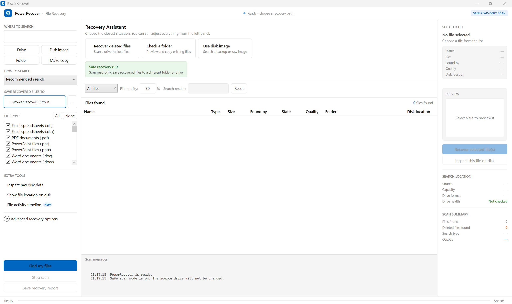
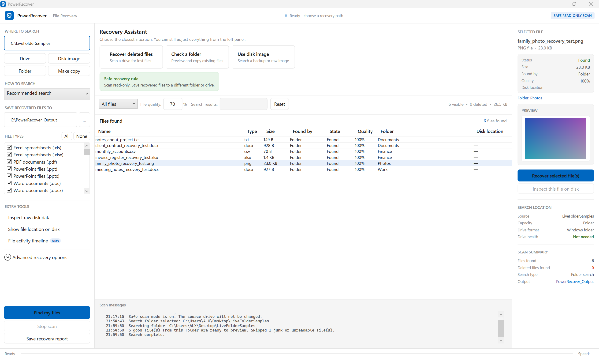

# PowerRecover

PowerRecover is a free, open-source Windows file recovery tool built with C#,
.NET 8, and WPF. It is designed around a simple rule: scan the source drive
read-only, preview what was found, and recover files to a different drive or
folder.


## What It Does

- Recovers deleted files from supported file systems when metadata is still
  available.
- Searches raw disk data for common file signatures when the file system is
  damaged.
- Checks normal folders and lets you preview/copy real files.
- Filters junk, unreadable files, system noise, and low-quality matches.
- Preserves folders where possible.
- Shows previews for images and readable text files.
- Includes a GUI app, command-line app, test kit, and bootable USB package
  files.

## Screenshots





## Safety First

PowerRecover is designed to read from the source and write recovered files to a
separate destination. For best results:

- Do not recover files back onto the drive you are scanning.
- If the drive is clicking, disconnecting, or very slow, clone it first and scan
  the clone.
- Do not install new software onto the drive you are trying to recover from.
- Recovery is never guaranteed. File quality depends on whether the original
  data has been overwritten.

More details: [docs/safety.md](docs/safety.md)

## Download

For normal users, download PowerRecover from the GitHub **Releases** page.

Recommended release assets:

- `PowerRecover-win-x64.zip` - normal Windows GUI app.
- `PowerRecover-bootable-usb-package.zip` - files used inside a Windows PE
  recovery USB.
- `SHA256SUMS.txt` - checksums for release files.

Do not download random EXE files from the source tree. The source repository is
for code and documentation; binaries belong in Releases.

## Build From Source

Requirements:

- Windows 10 or Windows 11
- .NET 8 SDK
- Visual Studio 2022 with .NET desktop development, or the .NET CLI

Build everything:

```powershell
dotnet build .\PowerRecover.sln -c Release
```

Run tests:

```powershell
dotnet test .\PowerRecover.Tests\PowerRecover.Tests.csproj -c Release
```

Run the GUI app:

```powershell
dotnet run -c Release --project .\PowerRecover.App
```

Physical drive scans usually require Administrator permission.

## Create Release ZIPs

Use the release packaging script:

```powershell
.\scripts\package-release.ps1
```

It creates release files under `release/`. Upload those ZIP files to GitHub
Releases. Do not commit them to the repo.

## Bootable USB GUI

PowerRecover can be packaged for a Windows PE style recovery USB so users get
the same graphical app, not just a command prompt.

Start here:

- [docs/bootable-usb.md](docs/bootable-usb.md)
- [BootableUsb/README.md](BootableUsb/README.md)

## Recovery Modes

Read this before testing recovery behavior:

- [docs/recovery-modes.md](docs/recovery-modes.md)

## Test Kit

The `TestRecoveryKit/` folder contains safe sample files and scripts for testing
inside a virtual machine or disposable test drive. It does not contain personal
data.

## Project Structure

```text
PowerRecover.App/       WPF desktop application
PowerRecover.Engine/    Recovery engine and scanners
PowerRecover.Cli/       Command-line entry point
PowerRecover.Tests/     Automated tests
BootableUsb/            Windows PE startup files
TestRecoveryKit/        Safe recovery test samples
docs/                   User and developer documentation
scripts/                Packaging and audit helpers
```

## Privacy Checklist Before Publishing

Run:

```powershell
.\scripts\audit-public.ps1
```

Then check that no personal files, recovered files, local output folders, build
folders, logs, or old copied EXE folders are being committed.

## Contributing

Contributions are welcome. See [CONTRIBUTING.md](CONTRIBUTING.md).

## Security

Please report security issues privately. See [SECURITY.md](SECURITY.md).

## License

PowerRecover is released under the MIT License. See [LICENSE](LICENSE).
